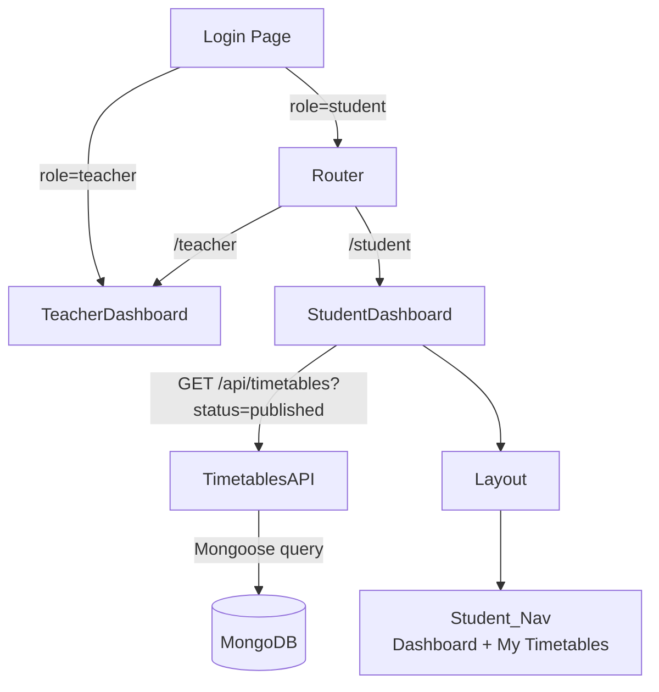

# Design Document: Student Dashboard

## Overview

This feature introduces a dedicated `StudentDashboard` page for ChronoCampus that replaces the current incorrect behaviour of routing student users to `TeacherDashboard`. The change touches three layers: backend API filtering, frontend routing, and a new React page component with a simplified layout.

---

## Architecture



The key architectural decision is to keep the student route entirely separate from the teacher route rather than conditionally hiding elements inside a shared component. This avoids prop-drilling, reduces coupling, and makes each dashboard independently maintainable.

---

## Components and Interfaces

### New / Modified Files

| File | Change |
|---|---|
| `frontend/src/pages/StudentDashboard.jsx` | **New** — student-only dashboard page |
| `frontend/src/App.jsx` | **Modified** — add `/student` route, update `RoleHome` redirect |
| `frontend/src/components/Layout.jsx` | **Modified** — add `studentNavItems`, render them for `isStudent()` |
| `backend/routes/timetableRoute.js` | **Modified** — support `?status` query param on `GET /` |

### `StudentDashboard` Component Interface

```jsx
// No props — reads everything from AuthContext and local state
export default function StudentDashboard()
```

Internal state:
```ts
timetables: Timetable[]       // all published timetables from API
filtered: Timetable[]         // timetables after semester/dept filter
loading: boolean
semesterFilter: string        // "" = all
departmentFilter: string      // "" = all
selectedTimetable: Timetable | null  // for inline view modal
```

### `studentNavItems` (Layout.jsx)

```js
const studentNavItems = [
  { id: "dashboard",   label: "Dashboard",      icon: LayoutDashboard, path: "/student" },
  { id: "timetables",  label: "My Timetables",  icon: Calendar,        path: "/timetables" },
];
```

---

## Data Models

No schema changes are required. The existing `Timetable` model already has a `status` field with enum `["draft", "published", "archived"]`.

### API Change — `GET /api/timetables`

Add optional `status` query parameter:

```js
// backend/routes/timetableRoute.js
timetablesRouter.get("/", async (req, res) => {
  const filter = {};
  if (req.query.status) filter.status = req.query.status;
  const timetables = await Timetable.find(filter);
  res.json(timetables);
});
```

This is backward-compatible — existing callers that omit `?status` continue to receive all timetables.

### Timetable Shape (relevant fields for StudentDashboard)

```ts
interface Timetable {
  _id: string;
  name: string;
  semester: string;
  year: number;
  department: string;
  status: "draft" | "published" | "archived";
  schedule: ScheduleEntry[];
}

interface ScheduleEntry {
  courseId: string;
  facultyId: string;
  roomId: string;
  day: string;
  startTime: string;
  endTime: string;
}
```

---

## Correctness Properties

*A property is a characteristic or behavior that should hold true across all valid executions of a system — essentially, a formal statement about what the system should do. Properties serve as the bridge between human-readable specifications and machine-verifiable correctness guarantees.*

Property 1: Published-only API filter
*For any* call to `GET /api/timetables?status=published`, every timetable object in the response array SHALL have `status === "published"`. No draft or archived timetable SHALL appear in the result.
**Validates: Requirements 3.1, 3.3**

Property 2: Client-side filter correctness
*For any* list of timetables and any combination of semester and department filter values, the filtered result SHALL contain exactly those timetables whose `semester` matches the selected semester (if set) AND whose `department` matches the selected department (if set).
**Validates: Requirements 6.1, 6.2, 6.3**

Property 3: Filter clear restores full list
*For any* filtered timetable list, clearing both filters SHALL restore the displayed list to the full set of published timetables fetched from the API — i.e., `filtered.length === timetables.length`.
**Validates: Requirements 6.4**

Property 4: No non-published timetables rendered
*For any* timetable rendered in the StudentDashboard list, the timetable's `status` SHALL equal `"published"`. This holds even if the API unexpectedly returns mixed-status results.
**Validates: Requirements 3.4**

Property 5: Student nav completeness
*For any* render of `Layout` where `isStudent()` is true, the set of rendered navigation item IDs SHALL equal exactly `{"dashboard", "timetables"}` — no more, no less.
**Validates: Requirements 4.1, 4.2**

---

## Error Handling

| Scenario | Behaviour |
|---|---|
| API call fails (network/500) | Show an error message in place of the timetable list; do not crash |
| API returns empty array | Show an empty-state illustration with "No published timetables available" |
| `selectedTimetable` has empty `schedule` | Show "No schedule entries" inside the view modal |
| Student navigates to restricted route | `ProtectedRoute` redirects to `/student` |

---

## Testing Strategy

### Unit / Example Tests

- Render `StudentDashboard` with mocked API returning mixed-status timetables → assert only published ones appear.
- Render `Layout` with `isStudent() = true` → assert nav contains exactly "Dashboard" and "My Timetables".
- Apply semester filter "Sem 1" to a list containing Sem 1 and Sem 2 timetables → assert only Sem 1 entries remain.
- Clear filters after applying both → assert full list is restored.

### Property-Based Tests

Property-based testing library: **fast-check** (already compatible with Vite/Vitest).

Each property test runs a minimum of **100 iterations**.

**Property 1 — Published-only API filter**
Tag: `Feature: student-dashboard, Property 1: published-only API filter`
Generate arbitrary arrays of timetable objects with random `status` values. Pass them through the same filter logic used in the route handler (`filter.status = "published"`). Assert every item in the result has `status === "published"`.

**Property 2 — Client-side filter correctness**
Tag: `Feature: student-dashboard, Property 2: client-side filter correctness`
Generate arbitrary arrays of published timetables with random `semester` and `department` strings, plus random filter values. Assert the filtered result equals the manually computed intersection.

**Property 3 — Filter clear restores full list**
Tag: `Feature: student-dashboard, Property 3: filter clear restores full list`
Generate an arbitrary published timetable list and arbitrary filter values. Apply filters, then clear them. Assert `filtered.length === original.length`.

**Property 4 — No non-published timetables rendered**
Tag: `Feature: student-dashboard, Property 4: no non-published timetables rendered`
Generate arbitrary mixed-status arrays. Pass through the client-side published guard. Assert no item with `status !== "published"` survives.

**Property 5 — Student nav completeness**
Tag: `Feature: student-dashboard, Property 5: student nav completeness`
For any render of Layout with student role, assert nav item IDs are exactly `["dashboard", "timetables"]`.
